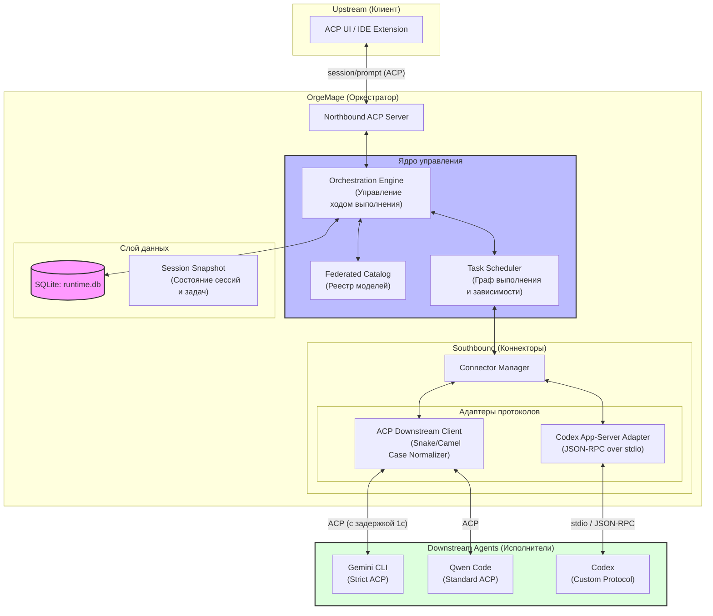
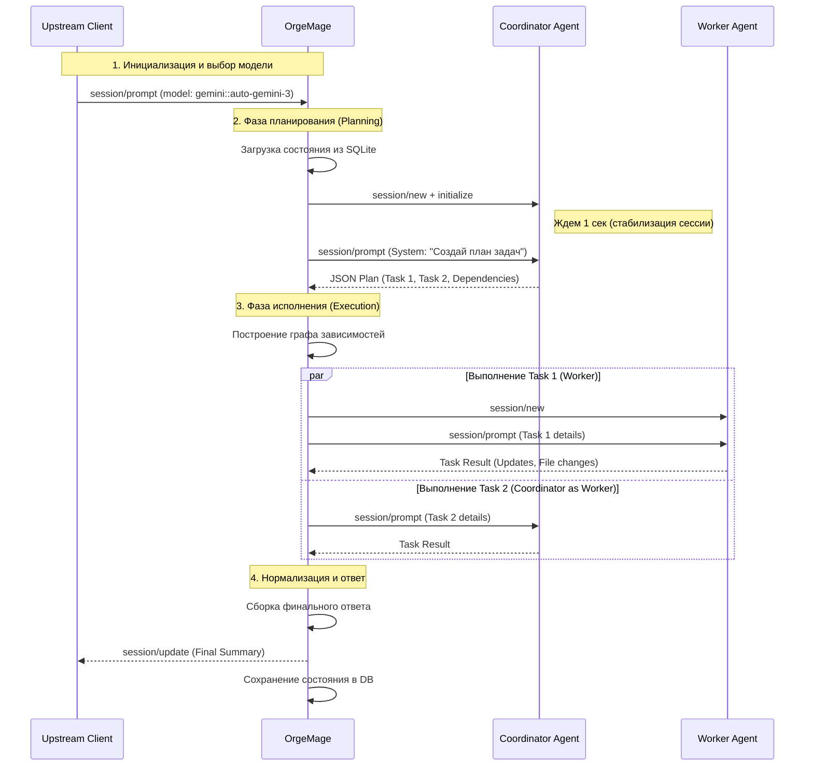

# Архитектура и рабочие процессы OrgeMage

В данном документе описана высокоуровневая архитектура системы OrgeMage, взаимодействие компонентов и жизненный цикл выполнения запросов.

## 1. Архитектурная схема

OrgeMage выступает в роли "умного прокси", который принимает запросы по протоколу ACP (Northbound) и делегирует их выполнение специализированным агентам (Southbound).

## 2. Жизненный цикл выполнения запроса (Turn Lifecycle)

Процесс обработки пользовательского ввода состоит из фазы планирования (выполняется Координатором) и фазы исполнения (выполняется набором Воркеров).

## 3. Ключевые технические решения

### 3.1. Нормализация протокола (Protocol Harmonization)
Для обеспечения совместимости с различными реализациями ACP (например, строгий `camelCase` в Gemini и гибкий `snake_case` в Python-агентах), OrgeMage:
*   Дублирует ключевые параметры в запросах: `session_id` (snake) и `sessionId` (camel).
*   Прокидывает обязательные поля, такие как `version` в `clientInfo` и `mcpServers` (даже если список пуст).

### 3.2. Управление состоянием сессий
*   **Задержка стабилизации**: Для CLI-агентов (Gemini) введена пауза в 1000 мс после создания сессии. Это предотвращает ошибки доступа, когда агент еще не успел зафиксировать сессию в своей внутренней БД.
*   **Persistence**: Все сессии, задачи и результаты выполнения сохраняются в SQLite, что позволяет восстанавливать контекст после перезапуска.

### 3.3. Федерация моделей
Каталог моделей динамически собирается со всех подключенных агентов. Каждая модель получает уникальный составной идентификатор `agent_id::model_id`, что позволяет однозначно определять исполнителя задачи.
